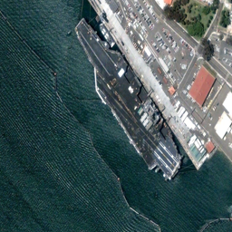
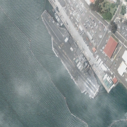
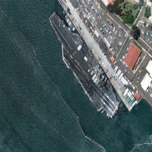

# [DA-Net: Dual Attention Network for Haze Removal in Remote Sensing Image](https://ieeexplore.ieee.org/abstract/document/10679105)
**Namwon Kim, Il-Seok Choi, Seong-Soo Han, and Chang-sung Jeong**
<br/>
IEEE Access, 2024
<br/>
[Manuscript](https://ieeexplore.ieee.org/abstract/document/10679105)

<br/> This is the **official implementation** of DA-Net: Dual Attention Network for Haze Removal in Remote Sensing Image (accepted by IEEE Access). <br/>


<br/> This code serves as a demo of DA-Net in our manuscript, offering a clear and organized workflow for haze removal in remote sensing images (RSI). <br/>

<table>
  <tr>
    <td>
    <p>Clean RSI</p>
    </td>
    <td>
    <p>Haze</p>
    </td>
    <td>
    <p>Dehazing result (DA-Net)</p>
    </td>
  </tr>
</table>

# Abstract
Haze removal in remote sensing images is essential for practical applications in various fields such as weather forecasting, monitoring, mineral exploration and disaster management. The previous deep learning models make use of large convolutional kernel and attention mechanisms for efficient dehazing. However, it has drawbacks such as the loss of image details and low performance. In this paper, we shall present a new dual attention network, called DA-Net, for dehazing remote sensing images which achieves better dehazing performance while reducing model complexity sharply by exploiting a novel dual attention block where two modules, channel-spatial attention and parallel attention are serially connected. We propose a new architecture for parallel attention which achieves better dehazing performance by concatenating three different attention mechanisms in parallel: global channel attention, local channel attention and spatial attention. Moreover, we shall show that the concatenation of channel-spatial attention to parallel attention module enables detecting haze component information more accurately while reducing the model complexity proportional to the number of parameters by combining the channel and spatial information generated respectively from two different channel and spatial branches. Our experimental results show that DA-Net achieves much better performance for both synthetic and real image data sets compared to the other dehazing models in terms of quantitative and qualitative evaluations.

# Requirements
timm <br/>
torchinfo <br/>
numpy <br/>
pillow <br/>
[pytorch](https://pytorch.org/get-started/locally/) <br/>
scikit-image <br/>
tqdm <br/>
ptflops <br/>
pytorch-msssim <br/>


# Dataset path
The dataset path should be organized as follows.
<br/><br/>
```
dataset/
├── RSID
│  ├── test
│  |   ├── GT
│  |   │   ├── 1.png
│  |   │   └── 2.png
│  |   │   └── ...
│  |   └── hazy
│  |       ├── 1.png
│  |       └── 2.png
│  |       └── ...
│  └── train
│       ├── GT
│       │   ├── 1.png
│       │   └── 2.png
│       │   └── ...
│       └── hazy
│           ├── 1.png
│           └── 2.png
│           └── ...
└── ...
```
<br/><br/>


```latex
@article{kim2024net,
  title={{DA-Net}: {D}ual-Attention Network for Haze Removal in Remote Sensing Image},
  author={Kim, Namwon and Choi, Il-Seok and Han, Seong-Soo and Jeong, Chang-Sung},
  journal={IEEE Access},
  volume={12},
  pages={136{297}--136{312}},
  year={2024},
  publisher={IEEE}
}
```

